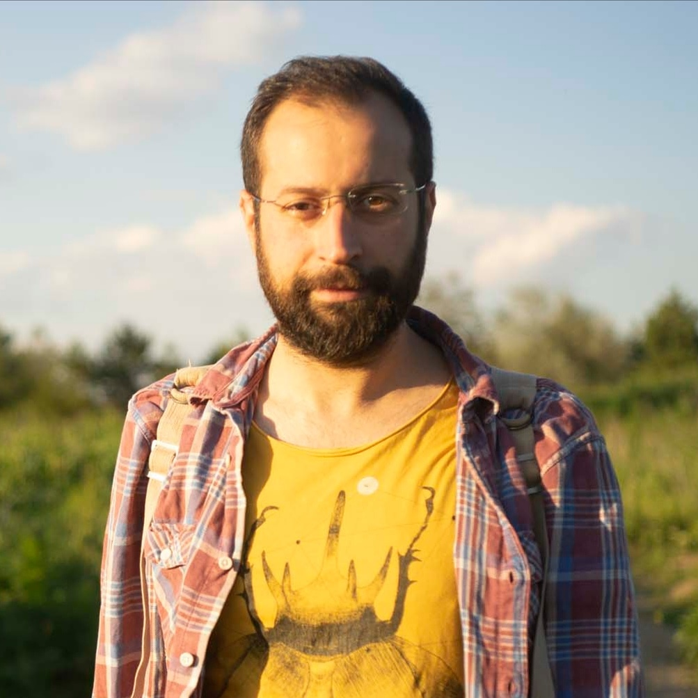

---
# Leave the homepage title empty to use the site title
title:
date: 2022-10-24
type: landing

sections:
  - block: hero
    content:
      title: Animal-Robot Interaction Lab
      image:
        filename: hero-academic.png
      text: |-
         
        A short description about the arilab.
    design:
      background:
        gradient_end: '#1976d2'
        gradient_start: '#004ba0'
        text_color_light: true

  - block: collection
    id: posts
    content:
      title: Recent Posts
      subtitle: ''
      text: ''
      # Choose how many pages you would like to display (0 = all pages)
      count: 5
      # Filter on criteria
      filters:
        folders:
          - post
        author: ""
        category: ""
        tag: ""
        exclude_featured: false
        exclude_future: false
        exclude_past: false
        publication_type: ""
      # Choose how many pages you would like to offset by
      offset: 0
      # Page order: descending (desc) or ascending (asc) date.
      order: desc
    design:
      # Choose a layout view
      view: compact
      columns: '2'

  - block: portfolio
    id: projects
    content:
      title: Projects
      filters:
        folders:
          - project
      # Default filter index (e.g. 0 corresponds to the first `filter_button` instance below).
      default_button_index: 0
      # Filter toolbar (optional).
      # Add or remove as many filters (`filter_button` instances) as you like.
      # To show all items, set `tag` to "*".
      # To filter by a specific tag, set `tag` to an existing tag name.
      # To remove the toolbar, delete the entire `filter_button` block.
      buttons:
        - name: All
          tag: '*'
        - name: Deep Learning
          tag: Deep Learning
        - name: Other
          tag: Demo
    design:
      # Choose how many columns the section has. Valid values: '1' or '2'.
      columns: '1'
      view: showcase
      # For Showcase view, flip alternate rows?
      flip_alt_rows: false

  - block: collection
    id: publications
    content:
      title: Publications
      text: |-
        {}
        Quickly discover relevant content by [filtering publications](./publication/).
        {}
      filters:
        folders:
          - publication
        exclude_featured: true
    design:
      columns: '2'
      view: citation

  - block: markdown
    id: people
    content:
      title: People
      subtitle:
      text: |-
        <!DOCTYPE html>
        <html>
        <head>
        
        </head>
        <body>
        
        

              

                
              

              

                <h2>Hande Alemdar</h2>
                <h1>Associate Professor</h1>
                <h1>alemdar[at]metu.edu.tr</h1>
              

            

        
        

              

                
              

              

                <h2>Okan Can Arslan</h2>
                <h1>Graduate Assistant</h1>
                <h1>okarslan[at]metu.edu.tr</h1>
              

            

        
        

              

                
              

              

                <h2>Babür Erdem</h2>
                <h1>PhD Candidate, Researcher</h1>
                <h1>ebabur[at]metu.edu.tr</h1>
                <h1>Personal blog: &nbsp; <a href="https://blog.metu.edu.tr/ebabur/" target="_blank" rel="noreferrer"> blog.metu.edu.tr/ebabur/ </a> </h1>
              

            

            
        

              

                
              

              

                <h2>Mustafa Yavuz Kara</h2>
                <h1>MSc Student</h1>
                <h1>myk[at]ceng.metu.edu.tr</h1>
              

            

        
        

              

                
              

              

                <h2>Oğuz Gödelek</h2>
                <h1>MSc Student</h1>
                <h1>godelek[at]ceng.metu.edu.tr</h1>
              

            

        
        </body>
        </html>
    
    design:
      # See Page Builder docs for all section customization options.
      # Choose how many columns the section has. Valid values: '1' or '2'.
      columns: '1'

      
  - block: contact
    id: contact
    content:
      title: Contact
      subtitle:
      text: |-
        Lorem ipsum dolor sit amet, consectetur adipiscing elit. Nam mi diam, venenatis ut magna et, vehicula efficitur enim.
      # Contact (add or remove contact options as necessary)
      email: test@example.org
      phone: 888 888 88 88
      appointment_url: 'https://calendly.com'
      address:
        street: 450 Serra Mall
        city: Stanford
        region: CA
        postcode: '94305'
        country: United States
        country_code: US
      directions: Enter Building 1 and take the stairs to Office 200 on Floor 2
      office_hours:
        - 'Monday 10:00 to 13:00'
        - 'Wednesday 09:00 to 10:00'
      contact_links:
        - icon: twitter
          icon_pack: fab
          name: DM Me
          link: 'https://twitter.com/Twitter'
        - icon: skype
          icon_pack: fab
          name: Skype Me
          link: 'skype:echo123?call'
        - icon: video
          icon_pack: fas
          name: Zoom Me
          link: 'https://zoom.com'
      # Automatically link email and phone or display as text?
      autolink: true
      # Email form provider
      form:
        provider: netlify
        formspree:
          id:
        netlify:
          # Enable CAPTCHA challenge to reduce spam?
          captcha: false
    design:
      columns: '2'
---
